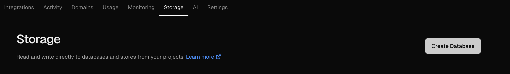
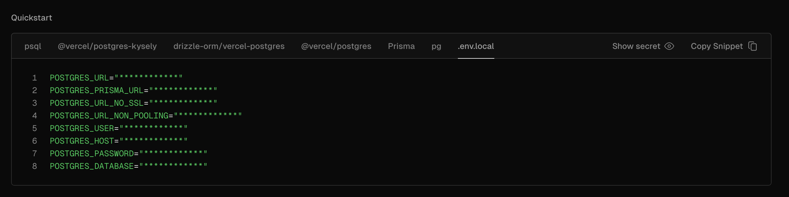

## How to setup Prisma with a Vercel hosted PostgreSQL database

If you don't have a Vercel account, you can create one [here](https://vercel.com/signup). Once you have an account, you have to navigate to the storage section and create a new database. You can do this by clicking on the "Create Database" button and selecting the PostgreSQL option. After that, you have to fill in the information it will request from you, but don't worry, it's pretty straightforward, just follow the instructions.

See the following image for reference:



### Copy your environment variables

After you have created your database, you will have to copy the environment variables that Vercel provides you. You can find them by selecting your new PostgreSQL database and navigating to the `.env.local` tab. You will see a list of variables that you can copy and paste into your `.env` file.



Just a reminder, you have to create a `.env` file in the root of your project and paste the variables there. Use the `.env.example` file as a reference.


If you don't want to copy all the environment variables, you can copy just what you need. Vercel gives you a hint of what you need by clicking on the `"Prisma"` tab, which contains something similar to the following:

```bash
datasource db {
  provider = "postgresql"
  url = env("POSTGRES_PRISMA_URL") // uses connection pooling
  directUrl = env("POSTGRES_URL_NON_POOLING") // uses a direct connection
}
```


### Initialize the database

Now that you have your environment variables set up, you can initialize your database by running the following command:

```bash
npx prisma db push
```

or if you want to use migrations (I recommend doing this):

```bash
npx prisma migrate deploy
```

Any of these commands will ensure the database schema matches the already defined `schema.prisma` file.


### Initialize the Prisma client

After you have initialized your database, you can generate the Prisma client by running the following command:

```bash
npx prisma generate
```

Or simply run:

```bash
npm install
```

This will install all the dependencies and generate the Prisma client for you.